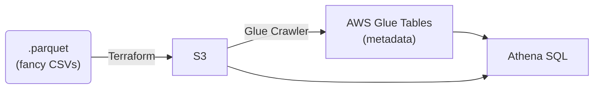

# Terraform, AWS Glue, Athena Demo



Using Terraform to configure all AWS resources, let's upload CSVs to S3 and use AWS Glue to treat
those CSVs as a database. ("AWS Glue Tables" created via an "AWS Glue Crawler," queried with SQL
via "Amazon Athena".)

## Local (macOS) installation, run
```
brew install awscli
aws configure
aws sts get-caller-identity --no-cli-pager
```

Terraform isn't OSI-compliant as of Apr 2025. So we'll use https://opentofu.org/ as a drop-in replacement instead.

```
brew install opentofu
tofu init
tofu plan -out tf.out
tofu apply tf.out
```

Our S3 bucket name is randomized. In our case it ended up with this name:

```
aws s3 ls s3://nyc-gov-zuo8vaqv
```

We have to run our Terraform-defined AWS Glue Crawler once to discover our input parquet files
and "turn them into" an AWS Glue Table. (The data actually lives in S3 forever, it's not actually
"pulled into" AWS Glue. AWS Glue just auto-discovers and remembers the meta-data for us.)

```
aws glue start-crawler --name parquet-data-crawler --region us-east-1
```

Now we can run `SELECT COUNT(*) FROM nyc_gov_zuo8vaqv` via AWS Athena.

It's working, yay!

Across those steps, you'll probably want to click around in AWS Console
to make sure steps are working, debug them:
* [IAM](https://us-east-1.console.aws.amazon.com/iam/home?region=us-east-1#/home)
* [S3 buckets](https://us-east-1.console.aws.amazon.com/s3/buckets?region=us-east-1&bucketType=general)
* [AWS Glue Crawlers](https://us-east-1.console.aws.amazon.com/glue/home?region=us-east-1#/v2/data-catalog/crawlers/view/csv-data-crawler)
* [AWS Glue Tables](https://us-east-1.console.aws.amazon.com/glue/home?region=us-east-1#/v2/data-catalog/tables)
* [AWS Athena SQL](https://us-east-1.console.aws.amazon.com/athena/home?region=us-east-1#/query-editor/history/da2df5ac-e759-4ac0-a6fb-1efd3dbfd118)
  * `SHOW TABLES;`
  * `SELECT COUNT(*) FROM nyc_gov_zuo8vaqv;`

Misc other things you can do:

```
aws athena get-table-metadata \
  --catalog-name AwsDataCatalog \
  --database-name nyc_gov_data_lake \
  --table-name nyc_gov_zuo8vaqv \
  --region us-east-1
```

```sql
SELECT
  year(tpep_pickup_datetime) year,
  month(tpep_pickup_datetime) month,
  count(*) trips,
  format ('$%, .2f', sum(fare_amount)) total_fare_amount
FROM nyc_gov_zuo8vaqv
GROUP BY 1,2
ORDER BY 1,2
```

In September 2025, I presented this as a talk to the
[Omaha Web Services Meetup](https://www.meetup.com/omaha-amazon-web-services-meetup/events/310573705/?recId=bfc7ca69-2883-403d-b4cf-eb382c41c26d&recSource=event-search&searchId=c03bf7d6-b012-475e-be3c-d3ff00d9f871&eventOrigin=find_page%24all).
My slide deck:
[PDF](https://www.dropbox.com/scl/fi/jzqgsofh2z6sv52ccea51/2025-AWS-Glue.pdf?rlkey=pjkp8mtvlpl9nm2mfm4f56l6d&dl=0),
[Keynote](https://www.dropbox.com/scl/fi/8wbuchswgb7hpl59ps1j7/2025-AWS-Glue.key?rlkey=fy99pmqtgiqja4cyy58942twu&dl=0).
