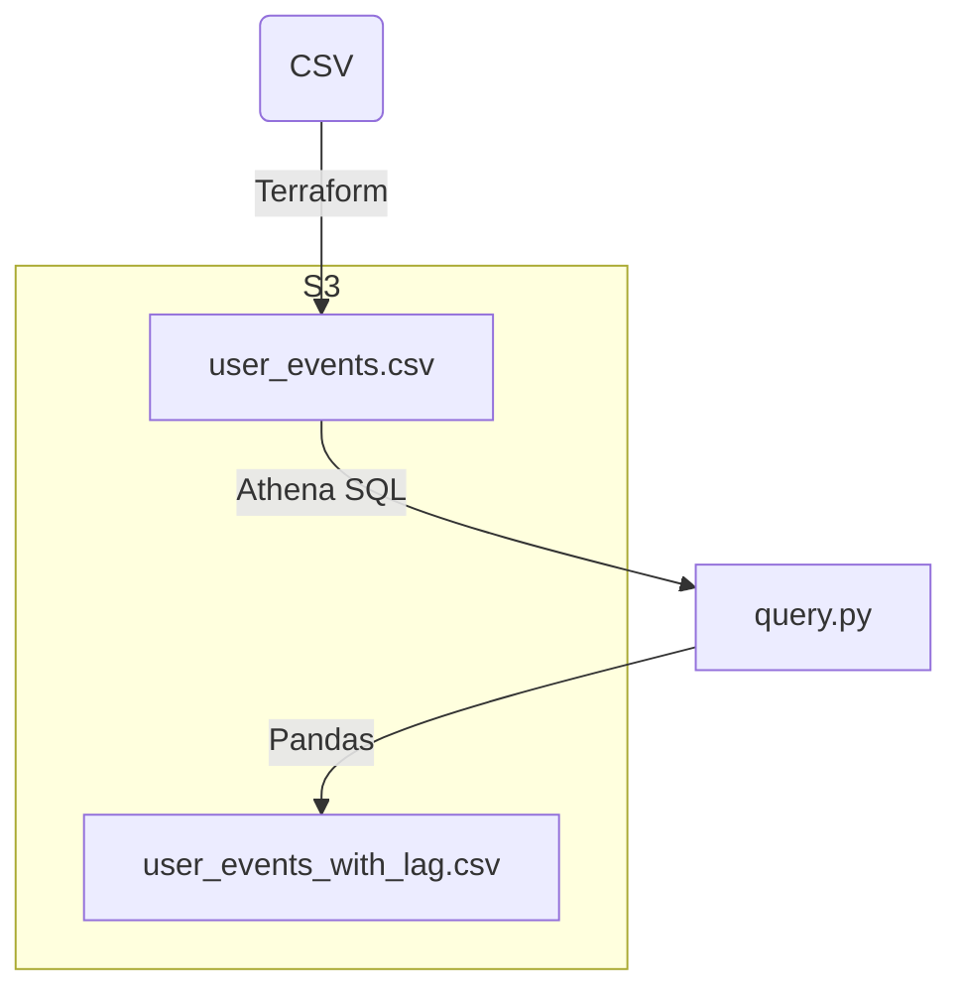

# Terraform, AWS Glue, Athena, Pandas Demo



Using Terraform to configure all AWS resources, let's upload a CSV to S3 and use AWS Glue to treat
that CSV as a database ("AWS Glue Tables" created via an "AWS Glue Crawler").

We'll then write a Python program to query that table (via "Amazon Athena SQL").
Inside Python, we'll use Pandas dataframes to calculate and add a new `lag_seconds` column.
We'll then export that dataframe as a CSV file, and upload that file back to S3.

## Local (macOS) installation, run
```
brew install awscli
aws configure
aws sts get-caller-identity --no-cli-pager
```

Terraform isn't OSI-compliant as of Apr 2025. So we'll use https://opentofu.org/ as a drop-in replacement instead.

```
brew install opentofu
tofu init
tofu plan -out tf.out
tofu apply tf.out
```

Our S3 bucket name is randomized. In our case it ended up with this name:

```
aws s3 ls s3://cp-s3-bucket-fy02qh9e
aws s3 cp s3://cp-s3-bucket-fy02qh9e/csv/user_events.csv /dev/stdout --quiet
```

We have to run our Terraform-defined AWS Glue Crawler once to discover our input CSV file
and "turn it into" an AWS Glue Table. (The data actually lives in S3 forever, it's not actually
"pulled into" AWS Glue. AWS Glue just auto-discovers and remembers the CSV meta-data for us.)

```
aws glue start-crawler --name csv-data-crawler --region us-east-1
```

Now we can run `SELECT * FROM user_events` via AWS Athena. So we can run our Python
program and enjoy the new output file it created:

```
✗ python3 query.py
/Users/jhannah/src/sandbox/cp/query.py:22: UserWarning: pandas only supports SQLAlchemy connectable (engine/connection) or database string URI or sqlite3 DBAPI2 connection. Other DBAPI2 objects are not tested. Please consider using SQLAlchemy.
  df = pd.read_sql(query, conn)
Uploading python_out/user_events_with_lag.csv to S3
```

(Do we want to switch to SQLAlchemy? Normally I would, but I that's probably out of scope for this demo?)

```
✗ aws s3 cp s3://cp-s3-bucket-fy02qh9e/python_out/user_events_with_lag.csv /dev/stdout --quiet

user_id,event_type,event_time,lag_seconds
1,login,2023-01-01 09:00:00,
1,click,2023-01-01 09:05:00,300.0
1,logout,2023-01-01 09:10:00,300.0
2,login,2023-01-01 10:00:00,
2,click,2023-01-01 10:05:00,300.0
2,click,2023-01-01 10:10:00,300.0
```

It's working, yay!

Across those steps, you'll probably want to click around in AWS Console
to make sure steps are working, debug them:
* [IAM](https://us-east-1.console.aws.amazon.com/iam/home?region=us-east-1#/home)
* [S3 buckets](https://us-east-1.console.aws.amazon.com/s3/buckets?region=us-east-1&bucketType=general)
* [AWS Glue Crawlers](https://us-east-1.console.aws.amazon.com/glue/home?region=us-east-1#/v2/data-catalog/crawlers/view/csv-data-crawler)
* [AWS Glue Tables](https://us-east-1.console.aws.amazon.com/glue/home?region=us-east-1#/v2/data-catalog/tables)
* [AWS Athena SQL](https://us-east-1.console.aws.amazon.com/athena/home?region=us-east-1#/query-editor/history/da2df5ac-e759-4ac0-a6fb-1efd3dbfd118)
  * `SHOW TABLES;`
  * `SELECT * FROM user_events;`
